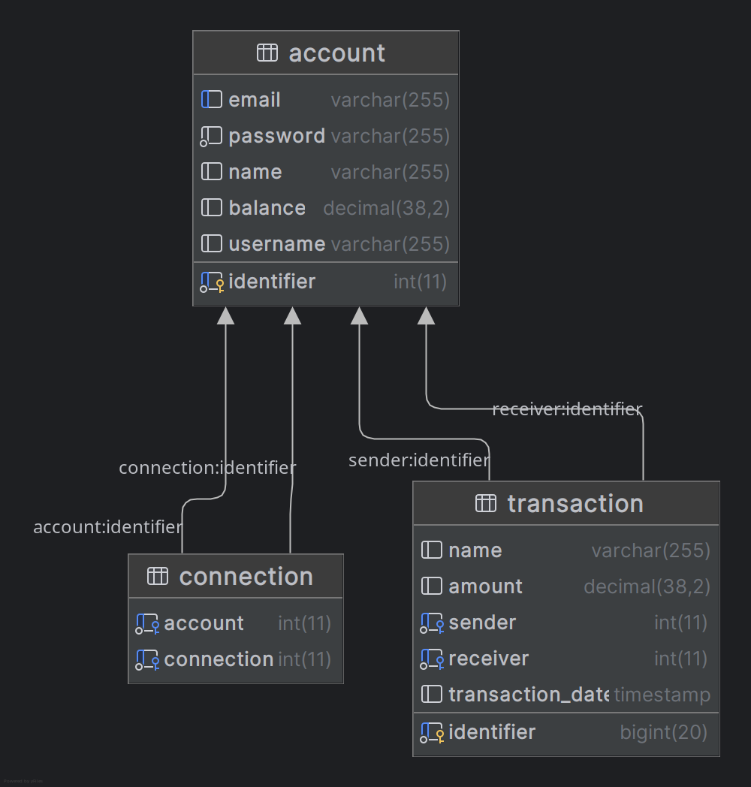

## Application

L'application est une première version de payMyBuddy.
Elle a été développée utilisant le jdk 21, maven 3.9.9, thymeleaf, et spring data jpa.

## Base de données

La base de données a été créée en utilisant mariadb qui était, à l'origine, un fork de mysql. 
Raison pour laquelle, des bases de données mysql ne devraient avoir aucun problème à lire et, donc, créer la base de données via les scripts présents dans le fichier resources/bdd/create_tables.sql.
Pour remplir la base de données, il y a le script qui se trouve dans le même dossier que create_tables.sql et qui s'appelle populate.sql.

## Modèle physique de données

